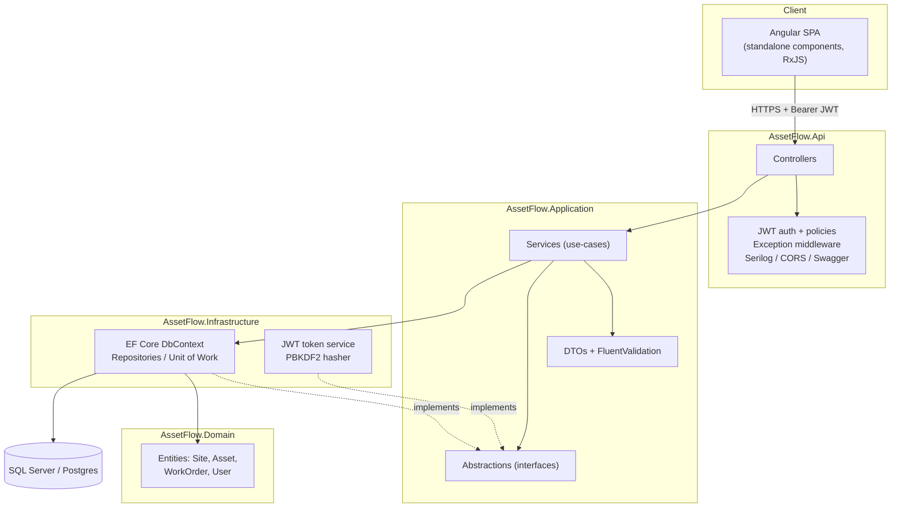
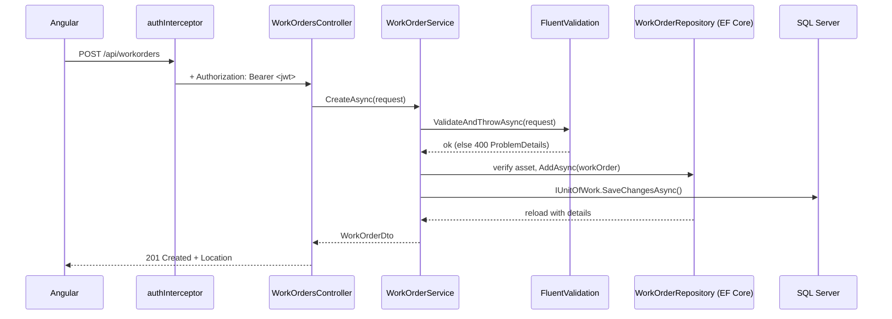

# AssetFlow

**Asset & work-order management service for energy operations** — a .NET 8 Web API (C#) with a clean layered architecture, backed by EF Core and a JWT-secured REST surface, paired with an Angular single-page client.

Built by **Yilin Xie** · [github.com/jane4399](https://github.com/jane4399) · jaxie@ucsd.edu · MIT licensed.

AssetFlow models the everyday domain of an industrial operator: **sites** own **assets** (pumps, compressors, valves), and **work orders** are raised against those assets and assigned to **technicians**. It is deliberately the same "authenticated entity CRUD" shape as a typical FastAPI task-tracker, re-expressed idiomatically in the Microsoft stack (C# / .NET / Angular / Azure) that Houston energy-IT roles ask for.

---

## Tech stack

| Layer | Technology |
| --- | --- |
| API | .NET 8, ASP.NET Core Web API, C# |
| Data | Entity Framework Core 8 (SQL Server provider; Postgres-ready), migrations |
| AuthN/AuthZ | JWT bearer (`Microsoft.AspNetCore.Authentication.JwtBearer`), PBKDF2 password hashing, role/policy authorization |
| Validation | FluentValidation |
| Docs | Swagger / OpenAPI (Swashbuckle) with a JWT scheme |
| Logging | Serilog (structured, console sink) |
| Testing | xUnit, Moq, FluentAssertions, `WebApplicationFactory` integration tests |
| Frontend | Angular 18 (standalone components), TypeScript (strict), RxJS, reactive forms, functional interceptors/guards |
| Delivery | Docker (multi-stage, non-root), docker-compose, GitHub Actions CI |

---

## Architecture

Clean, dependency-inverted layering. Dependencies point **inward** — the domain knows nothing about EF Core or ASP.NET; the outer layers depend on abstractions defined in the inner ones.



**Dependency direction:** `Api → Application → Domain` and `Infrastructure → Application → Domain`. Infrastructure implements the interfaces declared in Application (repositories, unit of work, token service, password hasher) and is wired at composition time, so the core has zero compile-time dependency on Entity Framework or ASP.NET.

### Request lifecycle (create a work order)



---

## Project structure

```
AssetFlow.sln
backend/
  src/
    AssetFlow.Domain/          # entities + enums (no dependencies)
    AssetFlow.Application/     # services, DTOs, validators, abstractions, mapping
    AssetFlow.Infrastructure/  # EF Core DbContext, repositories, migrations, security
    AssetFlow.Api/             # controllers, middleware, Program.cs, appsettings, Dockerfile
  tests/
    AssetFlow.UnitTests/       # service + validator unit tests (xUnit + Moq)
    AssetFlow.IntegrationTests/# WebApplicationFactory endpoint tests (in-memory EF)
frontend/
  src/app/core/                # models, typed API services, interceptors, guard
  src/app/features/            # login, work-order list, work-order detail/edit, asset list
docker-compose.yml             # api + sqlserver + nginx-served Angular
.github/workflows/ci.yml       # dotnet build/test + ng build/test
```

---

## Running locally

### Prerequisites
- .NET 8 SDK
- Node.js 20+ and the Angular CLI (`npm i -g @angular/cli`) — or use the local `npm` scripts
- SQL Server (local, or the one in `docker-compose.yml`)

### Backend

```bash
cd backend

# EF migrations are applied automatically at startup; to run them by hand:
dotnet tool install --global dotnet-ef        # once
dotnet ef database update \
  --project src/AssetFlow.Infrastructure \
  --startup-project src/AssetFlow.Api

dotnet run --project src/AssetFlow.Api
# API:     http://localhost:5080
# Swagger: http://localhost:5080/swagger
# Health:  http://localhost:5080/health
```

On first run the database is created/migrated and seeded with a site, two assets, two work orders, and two logins:

| Role | Email | Password |
| --- | --- | --- |
| Admin | `admin@assetflow.io` | `Admin123!` |
| Technician | `tech@assetflow.io` | `Tech123!` |

> The dev JWT signing key lives in `appsettings.json` for convenience. **Replace it** (and the connection string) via user-secrets, environment variables, or Key Vault before deploying.

### Frontend

```bash
cd frontend
npm install
npm start          # ng serve → http://localhost:4200
```

The dev client points at `http://localhost:5080/api` (see `src/environments/environment.development.ts`).

### Everything via Docker

```bash
docker compose up --build
# Angular (nginx):  http://localhost:8081
# API:              http://localhost:8080/swagger
```

`nginx` serves the built SPA and reverse-proxies `/api` to the API container, so the browser talks to a single origin.

### Tests

```bash
dotnet test                                   # backend unit + integration
cd frontend && npm test -- --watch=false      # Angular unit tests
```

---

## API surface

All routes are under `/api`. Every route except `auth/register` and `auth/login` requires a bearer token.

| Method | Route | Auth | Notes |
| --- | --- | --- | --- |
| POST | `/api/auth/register` | anonymous | creates a Technician, returns a token |
| POST | `/api/auth/login` | anonymous | returns a token |
| GET | `/api/auth/me` | any | echoes the token identity |
| GET | `/api/sites` / `/api/assets` / `/api/workorders` | any | paged, filtered, sorted |
| GET | `.../{id}` | any | single item (404 as ProblemDetails) |
| POST/PUT | `/api/sites`, `/api/assets` | **Admin** | writes |
| POST/PUT | `/api/workorders` | **Technician or Admin** | writes |
| DELETE | `.../{id}` | **Admin** | delete |

**Filtering & paging** (query string): `page`, `pageSize` (max 100), `sortBy`, `sortDir`, plus resource filters — work orders accept `status`, `priority`, `assetId`, `assignedTechnicianId`, `search`; assets accept `status`, `siteId`, `search`.

Errors are returned as RFC 9457 `application/problem+json`; validation failures use `ValidationProblemDetails` with a field→messages map.

---

## Design decisions

- **Layered / clean architecture.** Business logic sits in `Application` behind interfaces; `Infrastructure` provides the EF Core and security implementations. This keeps the core unit-testable without a database and lets the persistence technology change without touching use-cases.
- **Repository + Unit of Work over EF Core.** Repositories express intent (`SearchAsync`, `TagExistsAsync`) and hide `IQueryable`, so the Application layer never references Entity Framework. `AssetFlowDbContext` *is* the unit of work (`IUnitOfWork`), giving services one transactional `SaveChangesAsync`.
- **DTOs + FluentValidation.** Controllers never expose entities. Requests are validated in the service layer via `ValidateAndThrowAsync`; the global middleware turns failures into a 400 with a clean error map. Enums are validated with `IsInEnum()`.
- **JWT + policy authorization.** Stateless bearer tokens carry `sub`/`email`/`name`/`role`. Two policies (`RequireAdmin`, `RequireTechnician`) express who can write what. Passwords are stored as PBKDF2 (100k iterations, SHA-256, per-user salt) — never reversible.
- **Enums persisted as strings.** `Status`/`Priority` columns stay human-readable and survive enum re-ordering; filtering is done on them, while sorting is restricted to naturally-ordering columns.
- **Central audit timestamps.** `SaveChangesAsync` stamps `CreatedAtUtc`/`UpdatedAtUtc` from the change tracker, so no service can forget.
- **N+1 awareness.** List endpoints eager-load related data with `Include`; site asset-counts are fetched in a single grouped query rather than per-row.
- **SQL Server, switchable to Postgres.** The provider is chosen by the `DatabaseProvider` setting; both `Microsoft.EntityFrameworkCore.SqlServer` and `Npgsql.EntityFrameworkCore.PostgreSQL` are referenced. (Switching providers needs a provider-specific migration set — the checked-in migration targets SQL Server.)
- **Angular: standalone + functional primitives.** Standalone components with lazy routes, a functional `authInterceptor`/`errorInterceptor`, a functional `authGuard`, signals for view state, and a typed HttpClient service per resource.

---

## Azure deployment note

The stack maps cleanly onto Azure PaaS, which is what Houston energy-IT shops (e.g. Chevron) tend to standardize on:

- **Azure App Service (Linux)** hosts the containerized API (the multi-stage image already runs as non-root). The Angular build deploys to **Azure Static Web Apps** or a second App Service / Storage static site.
- **Azure SQL Database** replaces the local SQL Server — only the connection string changes; `DatabaseProvider` stays `SqlServer`. (Azure Database for PostgreSQL is the drop-in if the provider is switched.)
- **Azure Key Vault** holds the JWT signing key and DB connection string, surfaced through App Service settings or `DefaultAzureCredential` + the Key Vault configuration provider — nothing secret is committed.
- **Azure DevOps Pipelines / GitHub Actions** build and test both apps (see `ci.yml`), then `docker build`/`push` to **Azure Container Registry** and deploy to App Service. EF migrations run on startup or as a pipeline step (`dotnet ef database update`).
- **Application Insights** ingests the Serilog stream for tracing and health monitoring; `/health` backs App Service health probes.

---

## Honest limitations

- Access tokens only — no refresh-token rotation or revocation list yet.
- No dedicated user-management endpoints, so the work-order UI preserves an existing technician assignment rather than offering a technician picker.
- The checked-in EF migration is SQL Server-specific; targeting Postgres means regenerating migrations for Npgsql.
- Free-text search uses SQL `LIKE`; case sensitivity follows the database collation (case-insensitive on default SQL Server, case-sensitive on Postgres).
- Automated coverage focuses on representative slices (a service, a validator, auth endpoints) rather than exhaustive breadth.
- **This environment has no .NET SDK or Node**, so the code was written and statically self-reviewed but not compiled here — build on a machine with the .NET 8 SDK and Node 20+.
